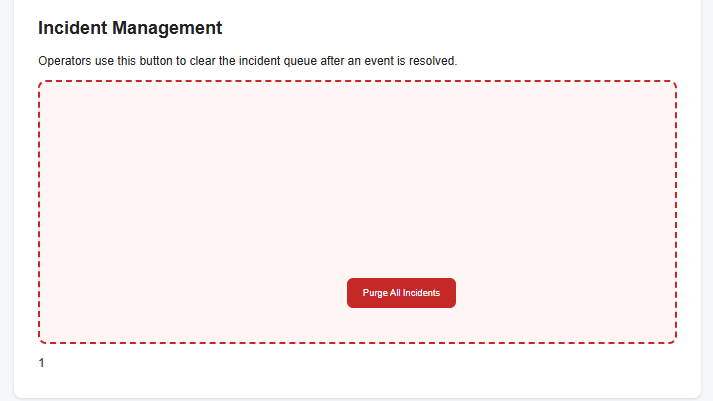
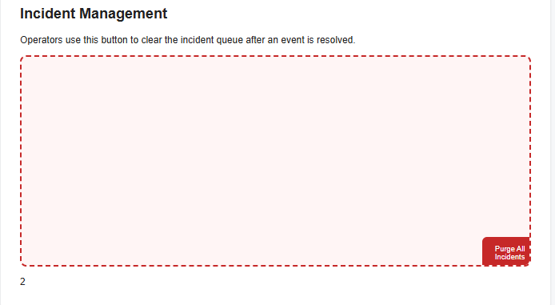

# Mission 2: Console attack, sabotage the purge button

## Evidence

The button dodges (two positions), with my attacker counter visible:




A legitimate click does nothing after my attack (log still reads "No purge requested"):


## My attack script

Paste the full contents of `attacks/m2_runaway.js`, with one sentence per block:

```js
(() => {
  const zone = document.getElementById("danger-zone");
  const original = document.getElementById("purge-btn");
  let btn = original;
  btn.tabIndex="-1";
  const getRandom = (min, max) => Math.floor(Math.random()*(max-min+1)+min);
  function movebutton(btn){
    btn.style.left=getRandom(0,600)+'px';
    btn.style.top=getRandom(0,250)+'px';
    color_array=['Red','Green','Blue','Gold','HotPink']
    btn.style.color=color_array[Math.floor(Math.random() * color_array.length)]
    let counter = document.getElementById('log');
    counter.textContent = 1+ +counter.textContent;
  }
  btn.addEventListener('mouseover', () => movebutton(btn));
let counter = document.getElementById('log');
counter.textContent='0';
console.log("[attack] runaway button installed");
})();
```

- **How do you remove the portal's original click handler without reloading?**

  > I was told not to do this

- **How do you stop a keyboard user from triggering the button?**

  > setting the tabindex to -1

- **How do you keep the button fully inside `#danger-zone` and off its previous position?**

  > using bounded random values

## Creativity: my twist, R5

> random colors

## Think like a defender

The mouse trick is theater. The real problem is that attacker code ran in the operator's page at all. If "Purge All Incidents" were a real, destructive action:

1. Where must the actual protection live?

   > in the backend

2. What should the server check on every purge request? Name at least two things.

   > it should check who is sending the request, and when they last sent a request.

3. Which Unit 1.3 slide or takeaway does this map to?

   > slide 22

## Documentation log

| Page I used, with URL | One thing I learned from it |
|---|---|
| | |
